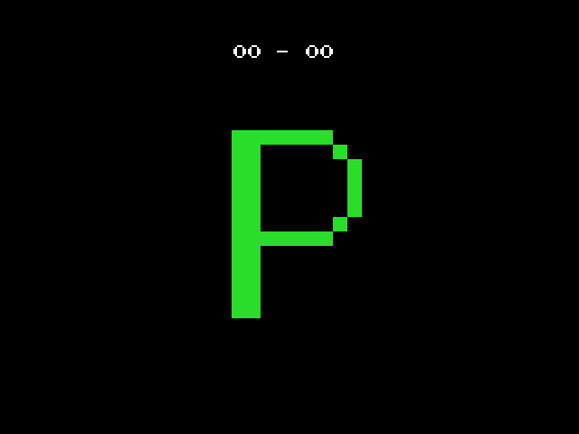

# Visor
Visor de mapeado de pantallas sin scroll para MSX en screen 2

## Changelog

* [15/03/2025] v1.0 - Primera versión

## Descripción

* Es una herramienta que me hice para mi uso personal.
* Sirve para ver las pantallas de un mapeado y poder moverte entre ellas con los cursores.
* La uso para ver en el emulador o en un MSX real el aspecto que van a tener, sobre todo los colores.
* En la primera línea, que suele tener el marcador, se muestran las coordenadas de la pantalla dentro del mapa. Esto lo puedes ajustar a tu gusto haciendo algún que otro cambio.
* Escrito en asm, concretamente he usado Sjasm Z80 Assembler v0.42c, de [XL2S Entertainment](https://www.xl2s.tk/).
* Trabaja con mapas de hasta 99x99 pantallas.
* Funciona de forma bastante directa si traes las pantallas desde [nMSXtiles](https://github.com/pipagerardo/nMSXtiles).
* Transiciones con efecto cortinilla a negro, que se puede desactivar con pocos cambios. Está explicado en el comentario de las rutinas do_arriba, do_abajo, do_derecha y do_izquierda (rutinas.asm).

## Uso

1. En el archivo constantes.asm tienes que dar el valor correcto a ANCHO_MAPA y ALTO_MAPA.
2. Coloca las pantallas, los tiles y sus colores en /gfx. Se da por hecho que están comprimidas con Pletter, de [XL2S Entertainment](https://www.xl2s.tk/).
3. En el archivo pantallas.asm haz los cambios a los incbin siguiendo el esquema de ejemplo. Cada pantalla debe tener su definición dw correspondiente.
4. En el raíz del proyecto, crea la carpeta out.
5. Compila con `sjasm src/main.asm`.
6. En /out tendrás el archivo main.bin, que puedes cargar con bload en el MSX.

## Licencia

Ninguna, puedes usar este código para lo que quieras.

# Créditos

* Escrito por [Orion](https://orionmsx.com/).
* Rutina de conversión a BCD publicada por "bore" en los [foros de msx.org](https://www.msx.org/forum/development/msx-development/bcdhex-conversion-asm).